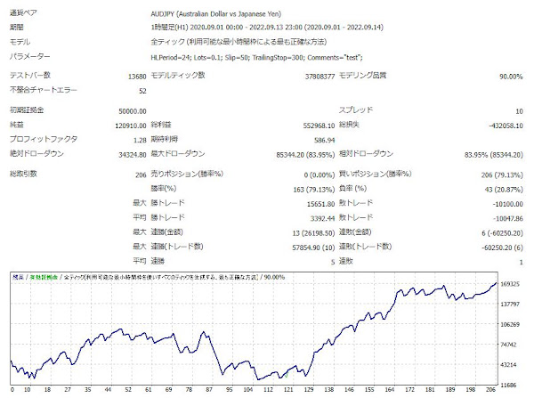

## はじめに

自作EAを作り始めた頃、決済方法として **トレーリングストップ** を使いたいと考えました。  
トレーリングストップはトラリピなどの自動売買でも人気があり、  
自作EAに挑戦し始めた人なら一度は実装したいと思うはずです。

そこで今回は、私が以前作成した **簡単なロジック＋トレーリングストップを組み込んだEA** のコードを紹介します。  
これから自作EAに挑戦する方の参考になれば幸いです。

---

## 概要（ロジック）

- **24時間以内の高値を上抜けたら買いエントリー**
- **300ポイント上昇したらトレーリングストップ開始**
- **トレーリング開始前に1000ポイント下落したら損切り**

### その他条件

| 項目 | 内容 |
|------|------|
| 通貨ペア | 自由（私は AUDJPY で運用） |
| 時間足 | 自由（1時間足を想定） |
| 最大ポジション | 1 |

---

## EAコード（MQL4）

```mq4
#define MAGIC 123456
extern int HLPeriod = 24;
extern double Lots = 0.1;
extern int Slip = 50;
input double TrailingStop = 300;
extern string Comments = "test";

double HLBand_2 = 0;
double HLBand_1 = 0;

int start()
{
    HLBand_2 = iCustom(NULL, 0, "HLBand", HLPeriod, 1, 2);

    // --- Entry logic ---
    if (OrdersTotal() < 1 &&
        Close[2] <= HLBand_2 &&
        Close[1] > HLBand_2)
    {
        if (!OrderSend(Symbol(), OP_BUY, Lots, Ask, Slip, Bid - Point * 1000, 0,
                       Comments, MAGIC, 0, Red))
        {
            Print("OrderSend error ", GetLastError());
        }
    }

    // --- Trailing Stop logic ---
    if (OrdersTotal() >= 1)
    {
        if (OrderSelect(0, SELECT_BY_POS, MODE_TRADES))
        {
            if (OrderType() == OP_BUY)
            {
                if (Bid - OrderOpenPrice() > Point * TrailingStop)
                {
                    if (OrderStopLoss() < Bid - Point * TrailingStop)
                    {
                        if (!OrderModify(OrderTicket(), OrderOpenPrice(),
                                         Bid - Point * TrailingStop, 0, 0, Green))
                        {
                            Print("OrderModify error ", GetLastError());
                        }
                    }
                }
            }
        }
    }

    return (0);
}


---
## バックテスト結果


---
## 注意点
※本EAはインディケーター「HLBand」を使用しています。
　MT4に標準搭載されていない場合は、別途インストールが必要です。

※本記事で紹介しているEAコードは、私が趣味で作成した参考用のものです。
　運用による損失については一切の責任を負いかねますので、自己判断でご利用ください。

